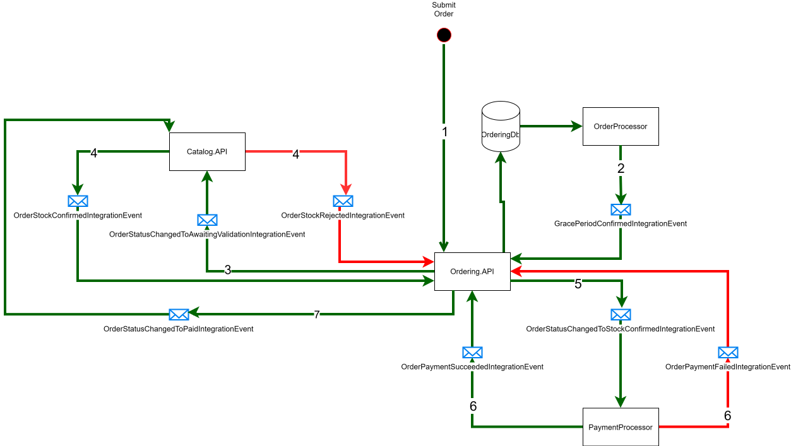
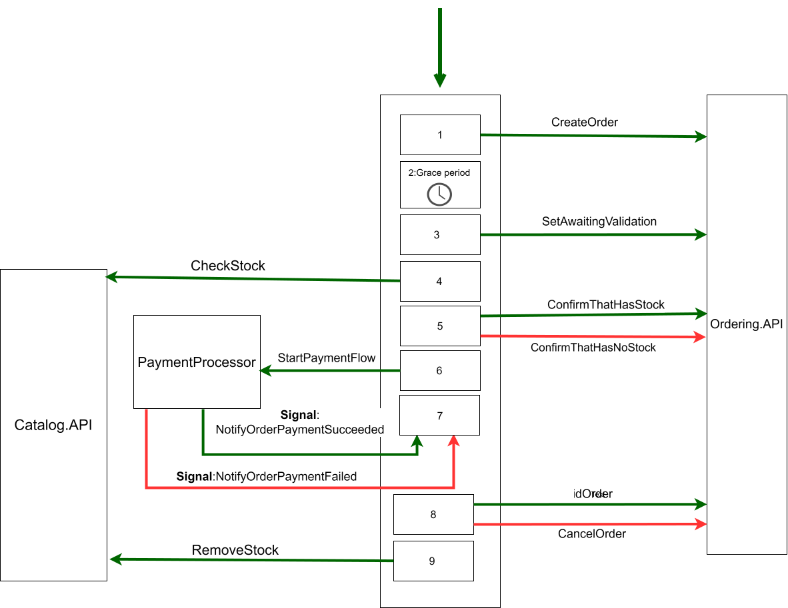

# eShopOnContainers + Temporal.io Workflows

This repository is an experiment in reimplementing the classic eShopOnContainers order saga using [Temporal.io](https://temporal.io/) workflows and activities.

It starts from the official [.NET Aspire–based eShop reference app](https://github.com/dotnet/eShop) and adds:

- A **Temporal dev server** hosted via a custom Aspire hosting integration.
- A **durable order saga** implemented as a Temporal workflow in C#.
- Activities that call the existing **Ordering**, **Catalog**, and **Payment** services.

The goal is to compare a traditional event-choreographed saga with a centrally orchestrated, durable workflow. 


## Motivation

After watching Temporal’s keynote on [The way forward for event-driven architectures](https://temporal.io/resources/on-demand/keynote-the-way-forward-for-event-driven-architectures), the idea was to see how the eShopOnContainers saga would look if implemented with Temporal instead of pure event choreography. :contentReference[oaicite:1]{index=1}

The original eShop saga is already a reference for event-driven microservices; this fork keeps that domain model but replaces the saga implementation with a Temporal workflow.


## Original eShop saga (baseline)



In the reference application, an order moves through its lifecycle via domain and integration events published between services:

1. **Checkout**  
   - ClientApp calls the **Create Order** endpoint (ClientApp → Ordering: `POST /api/Orders/`).  
   - Ordering creates the order in the Ordering DB and raises `OrderStartedDomainEvent`.

2. **Grace period & validation**  
   - The OrderProcessor polls the Ordering DB to find orders whose grace period has elapsed. After the grace period, a `GracePeriodConfirmedIntegrationEvent` is raised.  
   - Ordering handles this event, sets the status to *AwaitingValidation*, and raises `OrderStatusChangedToAwaitingValidationIntegrationEvent`.

3. **Stock validation (Catalog)**  
   - Catalog handles the `OrderStatusChangedToAwaitingValidationIntegrationEvent`, verifies stock, and publishes either `OrderStockConfirmedIntegrationEvent` or `OrderStockRejectedIntegrationEvent`.

4. **Payment**  
   - If stock is confirmed, Ordering notifies the Payment service with `OrderStatusChangedToStockConfirmedIntegrationEvent`.  
   - Payment responds with either `OrderPaymentSucceededIntegrationEvent` or `OrderPaymentFailedIntegrationEvent`.

5. **Completion / compensation**  
   - On success: the order is marked as *Paid* and stock is decremented.  
   - On failure (stock or payment): the order is set to *Cancelled*.

We can extend the saga and make it more complex for example implementing some product reservation logic in the Catalog service, and then compensating that reservation if the payment fails,
or implmenent the ship part after the payment is successful.But let keep it simple.

All of this is modeled as a **choreographed saga**: there is no central coordinator; each service reacts to events and emits new events.


## Temporal-based saga



In this fork, that same business process is expressed as a **Temporal workflow**  [`EShopWorkflow.cs`](./src/Temporal.Workflow/EShopWorkflow.cs) that becomes the single source of truth for the order lifecycle.

Conceptually, the workflow does:

1. **Start & create order**
   - Create the order through the Ordering service and store the resulting order ID inside the workflow.

2. **Grace period & awaiting validation**
   - Sleep for the configured grace period (Temporal timer).
   

3. **Resume the Order flow**
    - After a grace period (a few seconds), resume the Ordering flow by notifying the Ordering API by calling SetAwaitingValidation.

4. **Stock check**
   - Call a Catalog api to validate stock for all order items (CheckStock).
   
5. **Stock Confirmation**
    - If everything is available, notify the Ordering API that there is sufficient stock (ConfirmThatHasStock). The Ordering API records the order as “stock confirmed.”
    - If any item is missing, notify the Ordering API that there is insufficient stock (ConfirmThatHasNoStock). The Ordering API records “stock rejected” with item-level details and marks the order as cancelled.

6. **Trigger payment**
   - If stock is confirmed, invoke a Payment activity to start processing the payment (StartPaymentFlow).

7. **Wait for payment outcome (signals)**
   - The workflow waits for external **signals** indicating payment success or failure.
   
8. **Payment confirmation**
   - On success: mark the order as *Paid* (SetPaidOrderStatus).
   - On failure: mark the order as *Cancelled* (CancelOrder).

9. **Finalize**
   - Decrement  stock (RemoveStock).

All external calls (Ordering, Catalog, Payment) are implemented as **Temporal activities** with shared retry and logging configuration, giving you durability and consistent error handling across the saga. 


### The Integration Events
In this implementation, integration events are no longer the *center of the universe*, because they are no longer used to drive the saga. However, this does not mean they are not used at all. Some of them have been removed, but the ones published by the Order API when the order status changes are still there, because they are used to notify, in particular, the UI components about order status changes.

Since the loss of some events might be tolerable, we could potentially get rid of the Outbox pattern in the ordering service and replace the message broker (RabbitMQ) with something lighter, such as Redis Pub/Sub.

Alternatively if the loss is not tolerable, we could remove the Outbox pattern and move the notifications so that they are sent directly from the workflow activities.

## Temporal server integration (Aspire hosting)


To keep everything self-contained, the Temporal server runs as part of the Aspire host.

- A **custom Aspire hosting integration** in  
  [`TemporalResourceBuilderExtensions.cs`](./src/Temporal.Hosting/TemporalResourceBuilderExtensions.cs)  
  exposes extension methods to start a Temporal server using the `temporalio/auto-setup` image,  
  backed by PostgreSQL as the database (the same PostgreSQL instance used by the other resources in the solution).  
  It also provides extension methods to add the Temporal Admin Tools and the Temporal UI.

```csharp
  var temporal = builder.AddTemporal("temporal")
                        .WithPostgres(postgres)
                        .WithtTemporalAdminTools()
                        .WithtTemporalUi();
```


- The AddTemporal call returns a [`TemporalResource.cs`](./src/Temporal.Hosting/TemporalResource.cs)  instance that represents the Temporal server resource within the Aspire host.

- These extension methods are essentially a code-based implementation of the Docker Compose setup found here:
https://github.com/temporalio/docker-compose/blob/main/docker-compose-postgres.yml


For more details about Aspire hosting integrations, see the [Aspire documentation](https://learn.microsoft.com/en-us/dotnet/aspire/extensibility/custom-hosting-integration)
and about migrate from docker compose to Aspire see  [Migrate from Docker Compose to Aspire](https://learn.microsoft.com/en-us/dotnet/aspire/get-started/migrate-from-docker-compose)

