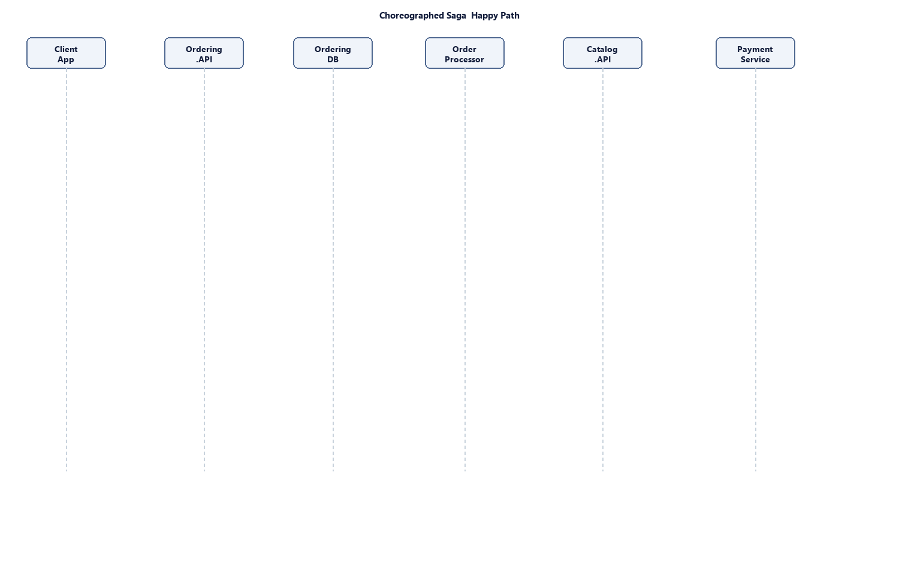
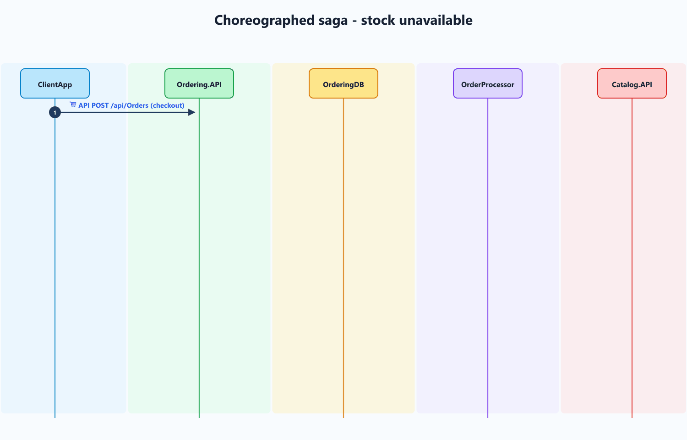
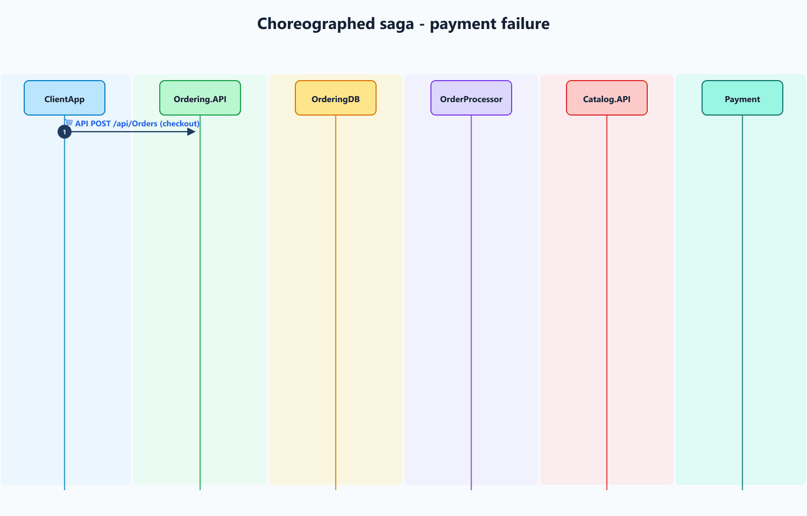
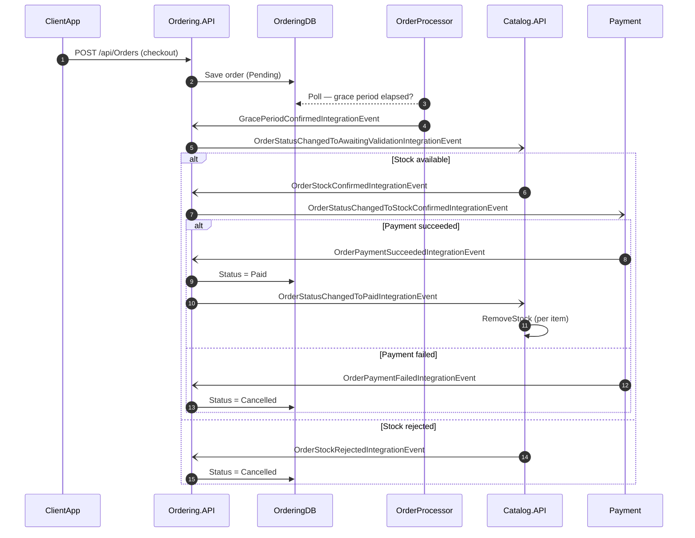
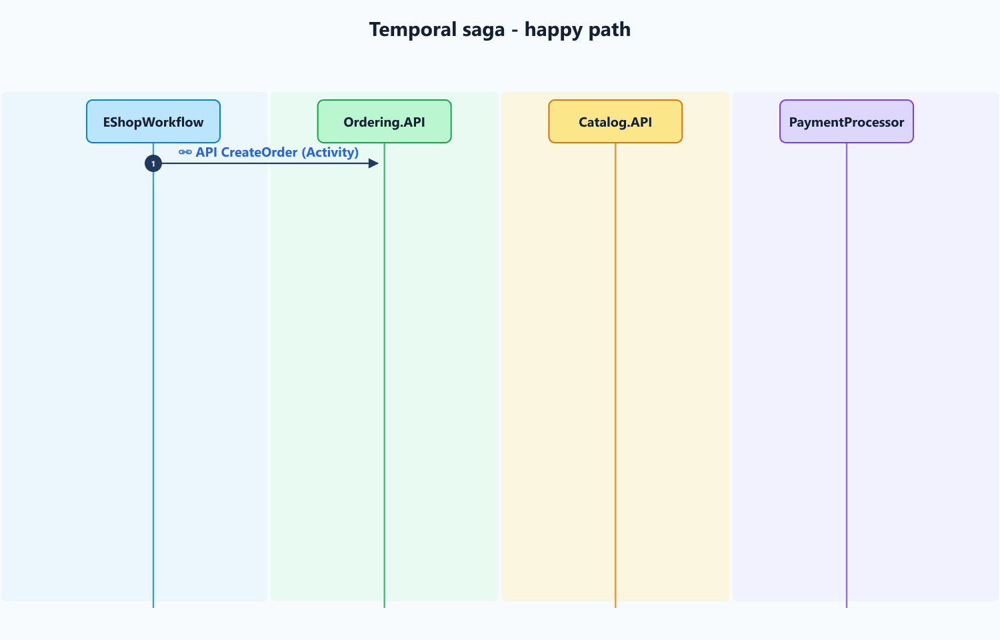
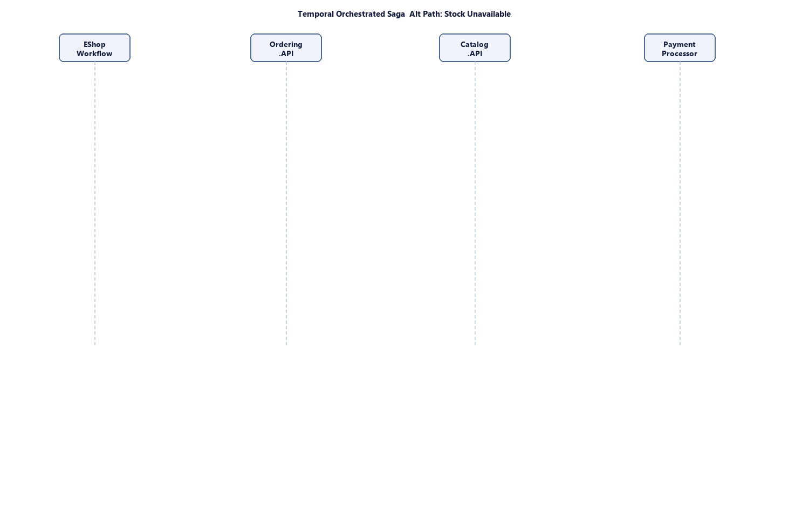
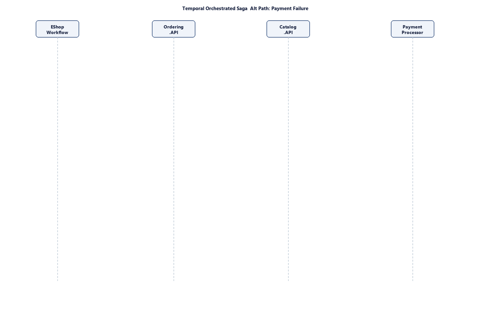
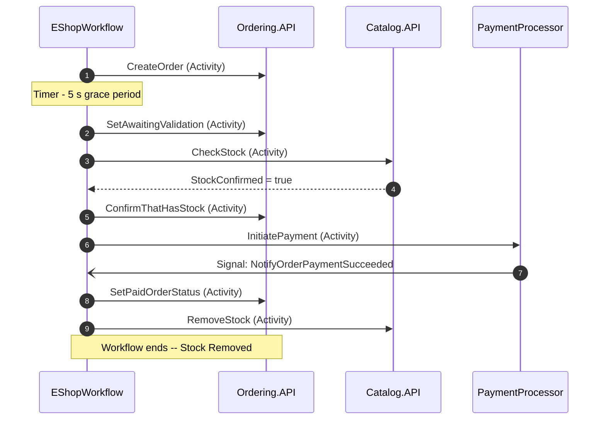
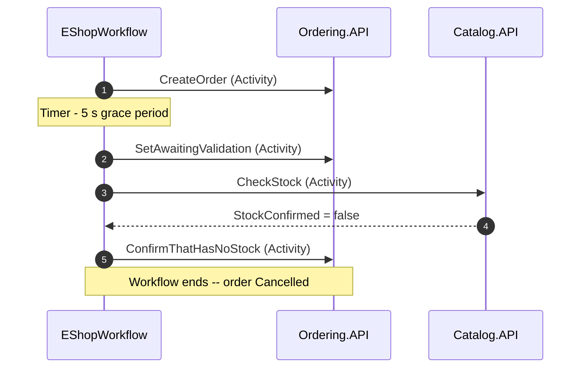
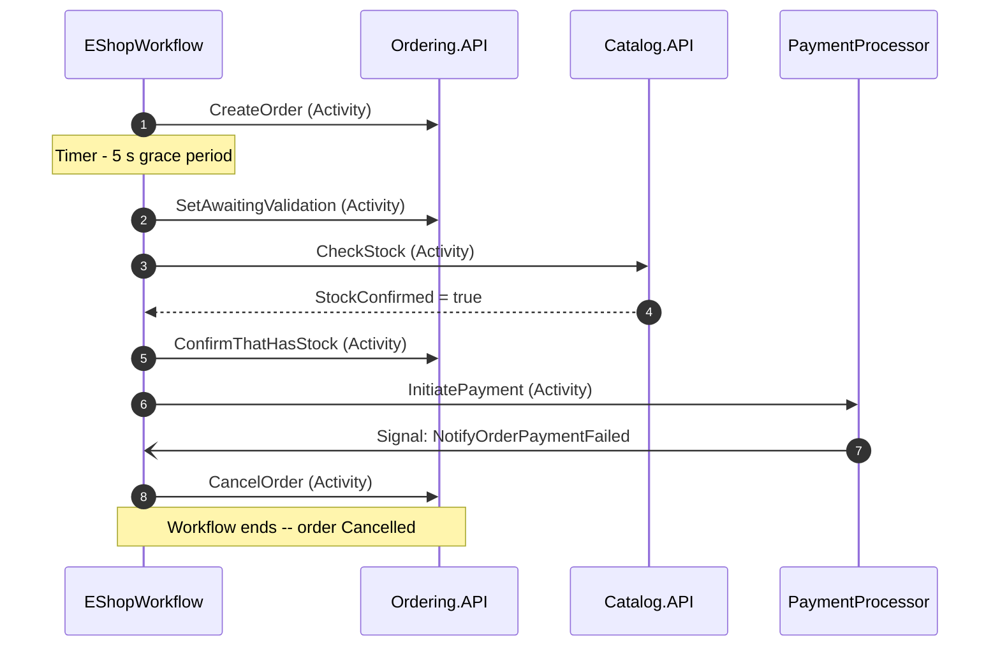

# eShopOnContainers + Temporal.io Workflows

This repository is an experiment in reimplementing the classic eShopOnContainers order saga using [Temporal.io](https://temporal.io/) workflows and activities.

It starts from the official [.NET Aspire–based eShop reference app](https://github.com/dotnet/eShop) and adds:

- A **Temporal dev server** hosted via a custom Aspire hosting integration.
- A **durable order saga** implemented as a Temporal workflow in C#.
- Activities that call the existing **Ordering**, **Catalog**, and **Payment** services.

The goal is to compare a traditional event-choreographed saga with a centrally orchestrated, durable workflow. 

## Quick start

This project is a reimplementation of the reference app [eShop](https://github.com/dotnet/eShop). To run it successfully, make sure your environment meets the same prerequisites as the original project, plus Docker for the backing services and Temporal server.

### Prerequisites

- **[.NET 10 SDK](https://dotnet.microsoft.com/download/dotnet/10.0)** — required to build and run the solution. The project pins `10.0.100` via `global.json` and allows roll-forward to newer .NET 10 feature bands.
- **[.NET Aspire workload](https://learn.microsoft.com/en-us/dotnet/aspire/fundamentals/setup-tooling)** — install after the SDK with `dotnet workload install aspire`.
- **[Docker Desktop](https://www.docker.com/products/docker-desktop/)** — required to run PostgreSQL, Redis, and the Temporal server container.
- **Git** — to clone the repository.

### Run locally

```bash
git clone https://github.com/fnandop/eshop-temporal-io.git
cd eshop-temporal-io
dotnet run --project src/eShop.AppHost/eShop.AppHost.csproj
```

After the Aspire dashboard starts, open the dashboard URL printed in the console. Verify that `temporal`, `temporalui`, `postgres`, `redis`, `ordering-api`, `catalog-api`, `payment-api`, and `webapp` are healthy.

To trigger the Temporal order workflow:

1. Open the `webapp` endpoint from the Aspire dashboard.
2. Add catalog items to the cart and place an order.
3. Open the `temporalui` endpoint and inspect the workflow history.

The workflow should show `CreateOrder`, the grace-period timer, stock validation, payment initiation, a payment success or failure signal, and the final order status update. See [How to Run and Test](#how-to-run-and-test) for detailed scenario testing and troubleshooting.

### Production notes

This is an educational sample. The payment callback is simulated, the local Temporal server uses the `auto-setup` Docker image, Temporal authentication is not configured, and stock decrement is intentionally simple. See [Known Limitations](#known-limitations) for details.


## Motivation

After watching Temporal’s keynote on [The way forward for event-driven architectures](https://temporal.io/resources/on-demand/keynote-the-way-forward-for-event-driven-architectures), the idea was to see how the eShopOnContainers saga would look if implemented with Temporal instead of pure event choreography. :contentReference[oaicite:1]{index=1}

The original eShop saga is already a reference for event-driven microservices; this fork keeps that domain model but replaces the saga implementation with a Temporal workflow.


## Original eShop saga (baseline)

### Happy path


### Alt path: Stock unavailable


### Alt path: Payment failure


> **Detailed static diagram:** [EShopSaga.drawio.svg](img/EShopSaga.drawio.svg)

In the reference application, an order moves through its lifecycle via domain and integration events published between services:

1. **Checkout**  
   - ClientApp calls the **Create Order** endpoint (ClientApp → Ordering: `POST /api/Orders/`).  
   - Ordering creates the order in the Ordering DB and raises `OrderStartedDomainEvent`.

2. **Grace period & validation**  
   - The OrderProcessor polls the Ordering DB to find orders whose grace period has elapsed. After the grace period, a `GracePeriodConfirmedIntegrationEvent` is raised.  
   - Ordering handles this event, sets the status to *AwaitingValidation*, and raises `OrderStatusChangedToAwaitingValidationIntegrationEvent`.

3. **Stock validation (Catalog)**  
   - Catalog handles the `OrderStatusChangedToAwaitingValidationIntegrationEvent`, verifies stock, and publishes either `OrderStockConfirmedIntegrationEvent` or `OrderStockRejectedIntegrationEvent`.

4. **Payment**  
   - If stock is confirmed, Ordering notifies the Payment service with `OrderStatusChangedToStockConfirmedIntegrationEvent`.  
   - Payment responds with either `OrderPaymentSucceededIntegrationEvent` or `OrderPaymentFailedIntegrationEvent`.

5. **Completion / compensation**  
   - On success: Ordering marks the order as *Paid* and publishes `OrderStatusChangedToPaidIntegrationEvent`. Catalog handles this event and decrements stock for each item.  
   - On failure (stock or payment): the order is set to *Cancelled*.
   gi
We can extend the saga and make it more complex for example implementing some product reservation logic in the Catalog service, and then compensating that reservation if the payment fails,
or implmenent the ship part after the payment is successful.But let keep it simple.

All of this is modeled as a **choreographed saga**: there is no central coordinator; each service reacts to events and emits new events.

### Message flow — sequence diagram



## Temporal-based saga

### Happy path


### Alt path: Stock unavailable


### Alt path: Payment failure


> **Detailed static diagram:** [EShopSagaTemporal.drawio.svg](img/EShopSagaTemporal.drawio.svg)

In this fork, that same business process is expressed as a **Temporal workflow**  [`EShopWorkflow.cs`](./src/Temporal.Workflow/EShopWorkflow.cs) that becomes the single source of truth for the order lifecycle.

Conceptually, the workflow does:

1. **Start & create order**
   - Create the order through the Ordering service and store the resulting order ID inside the workflow.

2. **Grace period & awaiting validation**
   - Sleep for the configured grace period (Temporal timer).
   

3. **Resume the Order flow**
    - After a grace period (a few seconds), resume the Ordering flow by notifying the Ordering API by calling SetAwaitingValidation.

4. **Stock check**
   - Call a Catalog api to validate stock for all order items (CheckStock).
   
5. **Stock Confirmation**
    - If everything is available, notify the Ordering API that there is sufficient stock (ConfirmThatHasStock). The Ordering API records the order as “stock confirmed.”
    - If any item is missing, notify the Ordering API that there is insufficient stock (ConfirmThatHasNoStock). The Ordering API records “stock rejected” with item-level details and marks the order as cancelled.

6. **Trigger payment**
   - If stock is confirmed, invoke a Payment activity to start processing the payment (StartPaymentFlow).

7. **Wait for payment outcome (signals)**
   - The workflow waits for external **signals** indicating payment success or failure.
   
8. **Payment confirmation**
   - On success: mark the order as *Paid* (SetPaidOrderStatus).
   - On failure: mark the order as *Cancelled* (CancelOrder).

9. **Finalize**
   - Decrement  stock (RemoveStock).

All external calls (Ordering, Catalog, Payment) are implemented as **Temporal activities** with shared retry and logging configuration, giving you durability and consistent error handling across the saga. 


### Orchestration flow — sequence diagrams

#### Happy path



#### No-stock path



#### Payment-failed path



### The Integration Events
In this implementation, integration events are no longer the *center of the universe*, because they are no longer used to drive the saga. However, this does not mean they are not used at all. Some of them have been removed, but the ones published by the Order API when the order status changes are still there, because they are used to notify, in particular, the UI components about order status changes.

Since the loss of some events might be tolerable, we could potentially get rid of the Outbox pattern in the ordering service and replace the message broker (RabbitMQ) with something lighter, such as Redis Pub/Sub.

Alternatively if the loss is not tolerable, we could remove the Outbox pattern and move the notifications so that they are sent directly from the workflow activities.

## Temporal server integration (Aspire hosting)


To keep everything self-contained, the Temporal server runs as part of the Aspire host.

- A **custom Aspire hosting integration** in  
  [`TemporalResourceBuilderExtensions.cs`](./src/Temporal.Hosting/TemporalResourceBuilderExtensions.cs)  
  exposes extension methods to start a Temporal server using the `temporalio/auto-setup` image,  
  backed by PostgreSQL as the database (the same PostgreSQL instance used by the other resources in the solution).  
  It also provides extension methods to add the Temporal Admin Tools and the Temporal UI.

```csharp
  var temporal = builder.AddTemporal("temporal")
                        .WithPostgres(postgres)
                        .WithtTemporalAdminTools()
                        .WithtTemporalUi();
```


- The AddTemporal call returns a [`TemporalResource.cs`](./src/Temporal.Hosting/TemporalResource.cs)  instance that represents the Temporal server resource within the Aspire host.

These extension methods are essentially a code-based implementation of the Docker Compose setup found here:
https://github.com/temporalio/docker-compose/blob/main/docker-compose-postgres.yml

> The local `Temporal.Hosting` integration is a work-in-progress and will eventually be replaced by the standalone NuGet package at [github.com/fnandop/nando-aspire-temporal](https://github.com/fnandop/nando-aspire-temporal).

For more details about Aspire hosting integrations, see the [Aspire documentation](https://learn.microsoft.com/en-us/dotnet/aspire/extensibility/custom-hosting-integration)
and about migrate from docker compose to Aspire see  [Migrate from Docker Compose to Aspire](https://learn.microsoft.com/en-us/dotnet/aspire/get-started/migrate-from-docker-compose)

## Payment signal pattern

To simulate the asynchronous callback that a real payment processor (e.g., Stripe) would send via webhook, the `PaymentProcessor` service runs its own short-lived Temporal workflow — [`PaymentWorkflowMockDelay.cs`](./src/PaymentProcessor/PaymentWorkflowMockDelay.cs).

This workflow waits a few seconds (mimicking payment processing time), then signals the main `EShopWorkflow` by its workflow ID using one of two named signals:

- `NotifyOrderPaymentSucceeded` — when `PaymentOptions:PaymentSucceeded` is `true`
- `NotifyOrderPaymentFailed` — when `PaymentOptions:PaymentSucceeded` is `false`

`EShopWorkflow` blocks on `WaitConditionAsync` until one of these signals arrives, then proceeds accordingly. This is a clean demonstration of Temporal's **signal-based async callback pattern**: instead of a direct HTTP callback, the result is delivered durably through the Temporal server, surviving restarts and network interruptions on both sides.

## How to Run and Test

Use the [Quick start](#quick-start) section above to install prerequisites, clone the repository, and launch the Aspire host. This section focuses on verifying that the Temporal workflow is running correctly and exercising the main order scenarios.

## Verify All Services Are Running

In the Aspire Dashboard, confirm that all resources show as **Healthy**:

| Resource | Status | Purpose |
|----------|--------|---------|
| **temporal** | ✅ Running | Temporal server (auto-setup image) |
| **temporalui** | ✅ Running | Temporal Web UI (admin tools) |
| **postgres** | ✅ Running | Shared PostgreSQL for Temporal and app services |
| **redis** | ✅ Running | Caching for catalog and basket services |
| **ordering-api** | ✅ Running | Order management microservice |
| **catalog-api** | ✅ Running | Product catalog microservice |
| **payment-api** | ✅ Running | Payment processing microservice |
| **webapp** | ✅ Running | Client web application |

## Testing the Order Workflow

### Step 1: Open the Online Store

1. Navigate to the **Aspire Dashboard**.
2. Find the **webapp** resource and click its endpoint URL.
3. The Online Store should open in your browser.

### Step 2: Place an Order

1. Browse the catalog and add items to your shopping cart.
2. Proceed to checkout and complete the order form.
3. Click **Place Order**.

### Step 3: Monitor the Temporal Workflow

1. In the **Aspire Dashboard**, find the **temporalui** resource.
2. Click its endpoint to open the **Temporal Web UI**.
3. Navigate to the **Workflows** section to see the active order workflow.
4. Click on the workflow to view the **Event History**.

The event history should show the workflow progressing through:
- `CreateOrder` activity
- Timer (grace period)
- `SetAwaitingValidation` activity
- `CheckStock` activity
- Stock confirmation/rejection
- `InitiatePayment` activity
- Payment signal (success or failure)
- Final status update (`SetPaidOrderStatus` or `CancelOrder`)
- `RemoveStock` activity (on successful payment)

### Step 4: Observe Different Scenarios

To test the alternative paths:

| Scenario | How to Trigger | Expected Outcome |
|----------|----------------|-------------------|
| **Payment Failure** | Set `PaymentOptions:PaymentSucceeded` to `false` in `src/PaymentProcessor/appsettings.json` (default) | Workflow receives `NotifyOrderPaymentFailed` signal, order is cancelled |
| **Payment Success** | Set `PaymentOptions:PaymentSucceeded` to `true` in `src/PaymentProcessor/appsettings.json` | Workflow receives `NotifyOrderPaymentSucceeded` signal, order is paid |
| **Stock Unavailable** | Add an item to cart, then manually reduce stock in the catalog via API, or add an item in a quantity exceeding its available stock | Workflow receives stock rejection, order is cancelled |

> `appsettings.json` changes require restarting the corresponding service to take effect.

---

## Known Limitations

This is an **experimental implementation** and intentionally differs from a production setup in the following ways:

| Area | Production Consideration |
|------|---------------------------|
| **Payment Signal** | The payment completion signal is simulated. In production, this would be driven by an async webhook or event from the payment processor. |
| **Security** | No authentication is configured for Temporal workflows. Production would require secure namespaces, mTLS, and workflow-level authorization. |
| **Temporal Server** | Uses the `auto-setup` Docker image for development. Production deployments should use a dedicated Temporal cluster with proper storage and high availability configuration. |
| **Stock Decrement** | The `RemoveStock` activity decrements inventory without a distributed lock. In production, consider stock reservation with a timeout to prevent overselling under high concurrency. |
| **Grace Period** | The 5-second grace period is hardcoded for demonstration. A production system would expose this as a configurable parameter per order or tenant. |

---

## Troubleshooting

| Issue | Solution |
|-------|----------|
| **Dashboard shows resources as unhealthy** | Ensure Docker Desktop is running. Restart the containers from the Aspire dashboard. |
| **Temporal UI is not accessible** | Check that the `temporalui` resource is healthy. Verify port mappings in Docker. |
| **Workflow not starting** | Check the `eshop-app` logs in the Aspire dashboard for errors. Verify the ordering API is reachable. |
| **dotnet run fails** | Ensure .NET 10 SDK is installed: `dotnet --version`. Clean and rebuild: `dotnet clean && dotnet build`. |
